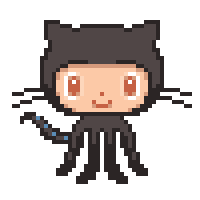

<!---
<!--horizontal divider(gradiant)-->

<!--h1 without bottom border-->

  
  
  

<!--- snake -->

  </a>

<!--h2 without bottom border-->

  <ul align="center">
    
<h2 style="display: inline-block">About me:</h2>

  </ul>

<!--Intro start-->
- 🔭 I’m currently working on **AWS, React, React Native, Nodejs, MongoDB**

- 🌱 I’m currently learning **to put together multiple Hyper Beast Stack for Scalable Applications.**

- ☁️ I've keen interest in cloud computing. So,I'm learning **AWS**

- 📝 I regularly write articles on [Hashnode](https://1010nishant.hashnode.dev/)

- 💬 Ask me about **AWS, react, react-native, nodejs, mongoDB**

- 📫 Feel free to reach me out **nishantjangid6377@gmail.com**

- 🏠 Also We've a tech community called [Dev Hac](https://discord.com/invite/p4TWyft886).
<!--Intro end-->

<!--- stats & Trophy (start) -->

  <!--- stats (start) -->
<table align="center">
<tr border="none">
<td width="50%" align="center">
  
  
    
   
</td>

<td width="50%" align="center">

  
  
  </td>
</tr>
</table>
<!--- stats (end) -->

        
<!--- stats (end) -->

<!--h1 without bottom border-->

  <ul align="center">
    
<h2 style="display: inline-block">Technologies That I Know👨🏻‍💻</h2>

  </ul>

<!--tech stack icons-->

  

<!-- Connect with me -->
<!--h2 without bottom border-->

  <ul align="center">
    
<h2 style="display: inline-block">Connect With Me &ensp;</h2>

    
  </ul>

<!--icons and links-->

  

<!--horizontal divider(gradiant)-->

