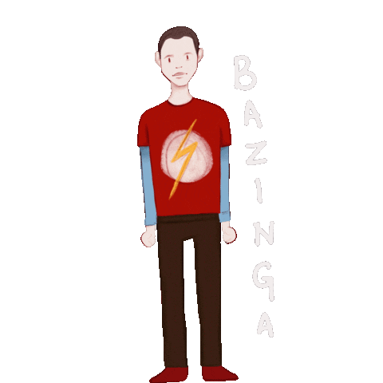
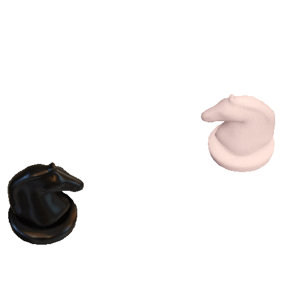

<!---
<!--horizontal divider(gradiant)-->

<!--h1 without bottom border-->

  
  
  

<!--- snake -->

  </a>

<!--h2 without bottom border-->

  <ul align="center">
    
<h2 style="display: inline-block">About me:</h2>

  </ul>

<!--Intro start-->
- 👨🏼‍💻 I’m currently working on **Backend Microservices with NodeJS & Plugin to intereact with Iot Objects with Java**

- 📚 I’m currently learning **Pattern Design, Docker and Embedded System**

- ☁️ I've keen interest in **Real-time System & Cybersecurity. Please see my [thesis](https://github.com/BrighentiPatrik/Tool-for-the-replication-of-datasets-of-CAN-frames-on-virtual-socket-respecting-the-timescales/blob/3838ba3ac22709b1f102bed9206eeedd09de2bd4/Thesis/Tesi_Brighenti_Patrik.pdf) about automotive security**

- 👨🏻‍🎓 I am strongly convinced that it is necessary to work and study simultaneously in our sector. I plan to start my **master degree** soon

- ♟️ I am a **chess enthusiast**. Please play with me, this in my [Lichess profile](https://lichess.org/@/Peci99)

- ✉️ Feel free to reach me out **brighenti.patrik@yahoo.com**

<!--- stats & Trophy (start) -->

  <!--- stats (start) -->
<table align="center">
<tr border="none">
<td width="50%" align="center">
  
  
    
   
</td>

<td width="50%" align="center">

  
  
  </td>
</tr>
</table>
<!--- stats (end) -->

        
<!--- stats (end) -->

<!--h1 without bottom border-->

  <ul align="center">
    
<h2 style="display: inline-block">Technologies That I Know👨🏻‍💻</h2>

  </ul>

<!--tech stack icons-->

  

<!-- Connect with me -->
<!--h2 without bottom border-->

  <ul align="center">
    
<h2 style="display: inline-block">Connect With Me &ensp; &ensp;</h2>

    
  </ul>

<!--icons and links-->

  

<!--horizontal divider(gradiant)-->

